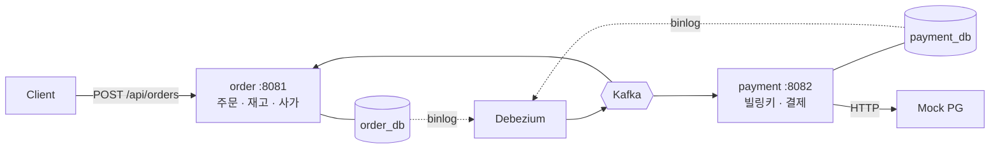
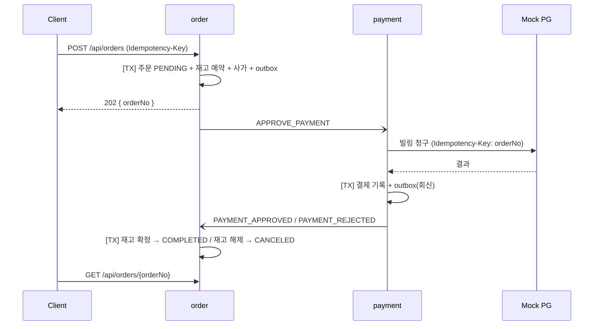

# Kafka 기반 주문·결제 분산 트랜잭션 설계 및 장애 검증

주문과 결제가 서로 다른 서비스와 DB로 나뉜 MSA 환경을 가정하여, 트랜잭션 하나로 묶을 수 없는 흐름을 Outbox·CDC·오케스트레이션 사가로 설계하고 메시지 중복, 깨진 메시지, PG 장애·타임아웃 상황에서 주문과 결제 상태가 어긋나지 않는지 검증한 프로젝트입니다.

## 요약

- Outbox + Debezium CDC로 DB 변경과 메시지 발행을 같은 트랜잭션에 묶음
- 오케스트레이션 사가로 주문 → 결제 → 재고 확정/해제 흐름 구성. 정상 경로는 요청 한 번에 1초 안에 완료
- 같은 `Idempotency-Key` 동시 3건 → 주문 1건, 청구 1건
- PG 500 응답 50% 주입에서 재시도 13회 발생, 주문 6건 모두 완료, 재고 누수 0
- PG 응답이 타임아웃을 넘긴 결제는 회신을 보류했다가 조회 API로 53초 뒤 승인 확정. 돈이 빠진 주문이 취소되지 않음
- Debezium 커넥터를 멈추면 65초 뒤 정체 사가 알람, 재개 1.2초 뒤 정상 완료

## 검증 범위

주문 접수부터 결제 승인, 재고 확정·해제까지의 흐름을 설계하고 서비스 경계에서 생기는 실패를 검증했습니다. 실제 PG 대신 실패율·지연을 주입할 수 있는 Mock PG(Toss 빌링 API 스펙 모방)를 사용했습니다. 인증, 결제 취소·환불, 정산 대사, 다중 브로커 구성은 제외했습니다.

## 아키텍처



| 토픽 | 방향 |
|--------|--------|
| `payment.commands` | order → payment (결제 승인 커맨드) |
| `order.saga.replies` | payment → order (승인·거절 회신) |
| `order.events` | order → 외부 (주문 완료·취소) |
| `*.DLT` | 처리하지 못한 메시지 보관 |

파티션은 3개, 키는 모두 `order_no`입니다.

## 흐름



## 설계

| 문제 | 선택 | 이유 |
|--------|--------|--------|
| DB 저장과 메시지 발행의 원자성 | Outbox + Debezium CDC | 저장 후 발행하면 발행 전 장애 시 메시지가 유실되고, 발행 후 커밋하면 없는 주문에 결제 요청이 나감. 같은 트랜잭션에 outbox를 INSERT하고 binlog로 발행 |
| 메시지 중복 | 컨슈머 멱등 테이블 | CDC는 at-least-once라 중복이 생김. `(message_id, consumer_group)` 선점을 비즈니스 로직과 같은 트랜잭션에서 INSERT 원자성으로 처리 |
| 여러 서비스에 걸친 흐름 | 오케스트레이션 사가 | 진행 상태를 한 곳(`saga_instance`)이 들고 있어야 멈춘 사가를 찾을 수 있음. 판정(순수 함수)과 영속화를 분리 |
| 재고 | order 내부 로컬 트랜잭션 | 별도 서비스로 두면 같은 분산 처리를 한 번 더 해야 함. 예약·확정·해제는 조건부 UPDATE |
| PG 응답 해석 | "돈이 빠졌는가" 기준 4분류 | 타임아웃을 실패로 처리하면 돈 빠진 주문에 보상이 돌고, 재청구하면 이중 결제. 모르는 경우는 회신을 보류하고 조회로 확정 |
| 중복 주문 요청 | `Idempotency-Key` 필수 | 결제가 걸린 요청이라 재시도를 흡수해야 함. 선점을 주문 트랜잭션 안에서 해 동시 요청을 유니크 인덱스로 직렬화 |
| 예외 없는 실패 | 나이 기반 정체 탐지 | Debezium이 멈추거나 회신이 유실되면 로그도 예외도 없음. 건수가 아닌 가장 오래된 사가의 나이로 알람 |
| 처리 불가 메시지 | DLT | 기본 동작은 재시도 소진 시 메시지를 버림. 원본 파티션 번호로 보관해 수동 복구 재료로 남김 |

### PG 결과 분류

| PG 응답 | 돈 | 처리 |
|--------|--------|--------|
| 2xx | 빠짐 | 승인 회신 |
| 카드 거절, 빌링키 없음 | 안 빠짐 | 거절 회신 → 재고 해제, 주문 취소 |
| `ALREADY_PROCESSED_PAYMENT` | 빠짐 | 성공으로 처리. 응답에 paymentKey가 없어 조회 API로 가져옴 |
| 409, 5xx | 안 빠짐 | DB를 건드리지 않고 예외 → Kafka 재시도 |
| 타임아웃, 모르는 코드 | 모름 | `IN_PROGRESS`로 남기고 회신 보류 → 복구 배치가 조회로 확정 |

## 검증

Mock PG의 실패율·지연 설정과 Debezium 커넥터 정지로 장애를 만들어 확인했습니다.

| 시나리오 | 결과 |
|--------|--------|
| 정상 결제 | 요청 한 번으로 주문 COMPLETED, 재고 예약 순증 0 |
| 카드 거절 (끝자리 0000) | 재고 완전 원복, 주문·사가 CANCELED, 결제 ABORTED |
| 같은 `Idempotency-Key` 동시 3건 | 멱등 선점 1행, 주문 1건, 청구 1건 |
| PG 500 50% 주입 | 500 13회 = 재시도 13회, 주문 6건 모두 COMPLETED, 재고 누수 0 |
| PG 500 100% 주입 | 6회 시도 후 DLT. 결제 행·outbox 0건, 주문 PENDING으로 정체 탐지 |
| PG 지연 5초 (read-timeout 3초) | 15:20:23 타임아웃 → `IN_PROGRESS`, 회신 0건 / 15:20:25 PG 승인 / 53초 뒤 조회로 승인 확정, PG가 발급한 paymentKey 저장, 주문 COMPLETED |
| 같은 이벤트 재발행 | 처리 1회. eventId만 바꾸면 PG 재호출 없이 회신만 재발행 |
| 깨진 JSON (poison pill) | 즉시 DLT, 원본 바이트 보존. 같은 파티션의 다음 메시지 정상 처리 |
| Debezium 커넥터 정지 | 65초 뒤 ERROR 1건, 정체 나이 게이지 상승 → 재개 1.2초 뒤 COMPLETED, 게이지 0 복귀 |

### 테스트

단위 테스트는 도커 없이 수 초 안에 끝나고(`./gradlew build`), 통합 테스트는 Testcontainers로 MySQL·Kafka를 띄웁니다(`./gradlew integrationTest`). 테스트 메서드 기준 단위 34개, 통합 51개입니다.

- 운영 DDL을 컨테이너에 그대로 마운트해 스키마가 어긋나지 않게 함
- 리스너는 진짜 브로커로, Mock PG는 진짜 HTTP로 호출해 read-timeout을 재현
- 코드를 일부러 망가뜨려 테스트가 잡는지 확인. `ErrorHandlingDeserializer`를 빼면 poison pill 테스트와 뒤따르던 3건이 함께 실패했고, 리스너 예외는 영구 차단이 아니라 지연일 뿐이라는 것도 이 과정에서 확인

## 구현 중 발견한 문제

- 여러 상품을 한 주문에 담으면 재고 락 획득 순서가 요청마다 달라 교차 주문 사이에 데드락이 날 수 있었음. productId 정렬로 고정하고 반환 타입을 `SortedMap`으로 좁혀 컴파일러가 순서를 강제하게 함
- API 멱등 선점에 `INSERT IGNORE`를 쓰면 128자를 넘는 키가 잘린 채 저장돼, 앞부분이 같은 두 키가 한 요청으로 병합됐음. 평범한 INSERT + 중복 키 예외 처리로 변경
- spring-kafka 4의 DLT 기본 접미사가 `.DLT`에서 `-dlt`로 바뀌어 첫 실행에서 DLT 발행이 실패. 운영이 아는 이름이라 접미사를 코드에서 고정
- 같은 DB 안에서 Hibernate가 쓴 시각은 UTC, JdbcTemplate이 쓴 시각은 KST로 저장되고 있었음. 테이블마다 쓰는 쪽과 지우는 쪽이 같아 동작에는 문제가 없지만, 통합 테스트 시드를 테이블마다 맞춰야 했음

## 남은 과제

- in-doubt 복구가 PG 조회의 `NOT_FOUND`를 "청구가 닿지 않음"으로 보고 거절을 확정함. PG가 처리 중인 청구를 조회에 보여주지 않으면 돈은 빠졌는데 주문이 취소될 수 있음. 같은 멱등키로 재요청해 수렴시키도록 수정 예정
- PG 장애가 재시도 예산(약 10초)보다 길면 커맨드가 DLT로 감. 장애 중 소비 일시정지와 DLT 재처리 도구 필요
- 결제 금액을 회신 경로에서 대조하지 않음
- payment 서비스 메트릭(in-doubt 건수·나이) 부재
- 정산 대사, 결제 취소·환불

## 실행

```bash
docker compose up -d

# 토픽 생성 (auto-create 꺼져 있음)
docker exec kop-kafka bash -c '
for t in payment.commands order.saga.replies order.events \
         payment.commands.DLT order.saga.replies.DLT; do
  kafka-topics --bootstrap-server localhost:29092 \
    --create --topic $t --partitions 3 --replication-factor 1
done'

# Debezium 커넥터 등록
for s in order payment; do
  curl -X POST -H 'Content-Type: application/json' \
    --data @docker/connect/$s-outbox-connector.json localhost:8083/connectors
done

./gradlew :order:bootRun
./gradlew :payment:bootRun
```

```bash
# 카드 등록 (고객당 1회)
curl -s localhost:8082/api/payments/billing-keys -H 'Content-Type: application/json' \
  -d '{"customerId":"C-1","cardNumber":"1234567812345678"}'

# 주문 → 결과 조회
curl -s localhost:8081/api/orders -H 'Content-Type: application/json' \
  -H "Idempotency-Key: $(uuidgen)" \
  -d '{"customerId":"C-1","items":[{"productId":"P-1001","quantity":2}]}'
curl -s localhost:8081/api/orders/{orderNo}
```

## 기술 스택

Java 21, Spring Boot 4.1, Spring Kafka 4, JPA, MySQL 8, Kafka 7.7 (KRaft), Debezium 2.7, Testcontainers
